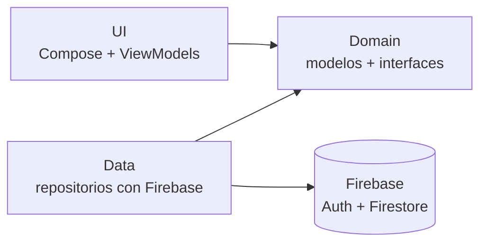

# Futbolboxd ⚽

**Futbolboxd** es una app móvil hecha con **Kotlin Multiplatform (KMP)** y **Compose Multiplatform**, pensada como un *Letterboxd* de fútbol. Los usuarios descubren partidos de la Premier League y la Liga Profesional Argentina, los puntúan con estrellas, escriben reseñas, guardan favoritos y siguen a otros aficionados.

> Proyecto desarrollado para el challenge técnico de AranguriApps.

## Índice
1. [De qué trata el proyecto](#1-de-qué-trata-el-proyecto)
2. [Arquitectura](#2-arquitectura)
3. [Uso de herramientas de IA](#3-uso-de-herramientas-de-ia)
4. [Decisiones técnicas y limitaciones](#4-decisiones-técnicas-y-limitaciones)
5. [Cómo compilar y correr el proyecto](#5-cómo-compilar-y-correr-el-proyecto)
6. [Estructura del repositorio](#6-estructura-del-repositorio)
7. [Documentación adicional](#7-documentación-adicional)

---

## 1. De qué trata el proyecto

Futbolboxd conecta a los aficionados a través de sus opiniones sobre los partidos.

- **Explorar:** el Home muestra filas horizontales por categoría (*Partidos de la Semana*, *Premier League*, *Fútbol Argentino*). La pantalla de Búsqueda filtra en tiempo real por equipo, competición o estadio. Ambas tienen *pull-to-refresh*.
- **Detalle de partido:** banner con los dos escudos, el resultado, el estadio, la fecha y la calificación promedio de la comunidad.
- **Reseñas:** puntaje de 1 a 5 estrellas y texto (hasta 500 caracteres). Cada usuario tiene una reseña por partido y puede editarla o eliminarla.
- **Favoritos:** cualquier partido se puede guardar y consultar desde el perfil.
- **Social:** perfiles propios y públicos, seguidores y seguidos, y la opción de seguir a otros usuarios desde sus reseñas.
- **Cuenta:** registro, inicio de sesión (la sesión persiste), edición de perfil y cierre de sesión.

## 2. Arquitectura

Se usó **Clean Architecture** con **MVVM** y flujo de datos unidireccional (`StateFlow`), todo dentro del módulo compartido `commonMain`.



- **Domain:** modelos (`Match`, `Review`, `UserProfile`), `AppResult` e interfaces de repositorio (`AuthRepository`, `MatchRepository`, `ReviewRepository`, `UserRepository`). No depende de Firebase ni de Compose.
- **Data:** implementa esas interfaces con **GitLive Firebase** (Auth y Firestore). Usa subcolecciones para `favorites`, `followers` y `following`.
- **UI:** pantallas en Compose Multiplatform y Material 3. Cada pantalla tiene un ViewModel que expone un `StateFlow<UiState>`, inyectado con **Koin**. La navegación usa JetBrains Navigation Compose.

**Regla de dependencia:** `ui` y `data` dependen de `domain`, y `domain` no depende de ninguna de las dos.

**Por qué esta arquitectura**
- Los ViewModels dependen de **interfaces**, no de Firebase. Esto permite probarlos con repositorios falsos y cambiar el backend sin tocar la UI.
- El estado de cada pantalla es un único `UiState` inmutable (carga, contenido, error), lo que evita recomposiciones innecesarias y estados inconsistentes.
- Los errores de red o de Firebase se devuelven como `AppResult` en vez de lanzar excepciones hacia la UI, para evitar crashes.

### Modelo de datos (Firestore)

```
matches/{matchId}          equipos, escudos, resultado, estadio, competición, fecha, tags
reviews/{userId_matchId}   una reseña por usuario y partido
users/{userId}             username, bio
  ├─ favorites/{matchId}
  ├─ followers/{userId}
  └─ following/{userId}
```

Cada fila del Home es una consulta a `matches` por etiqueta (`tags array-contains`).

## 3. Uso de herramientas de IA

- **Gemini en Android Studio (agente del IDE):** generación de pantallas Compose, ViewModels y repositorios. Se trabajó con **una tarea por prompt**, con commit antes y después, y siempre pidiendo un plan antes de editar.
- **Claude:** planificación y especificación de requisitos (SRS), decisiones de arquitectura, diseño de los prompts para el agente y revisión de su salida.

### Cómo audité lo que generó la IA
Cada cambio se revisó en el diff, se compiló y se probó en el emulador antes de hacer commit. Problemas concretos que detecté y corregí:

- **Coil:** el agente propuso `coil-network-okhttp` y `coil-network-darwin`; los reemplacé por `coil-network-ktor3` en `commonMain` más los motores de Ktor por plataforma.
- **Versiones de librerías:** verifiqué la consistencia entre Navigation, Lifecycle y Compose Multiplatform antes de aceptar la propuesta.
- **Recursos:** detecté código con `R.drawable` (solo Android) y lo reemplacé por `Res` de Compose Multiplatform, compatible con `commonMain`.
- **Windows:** una ruta con caracteres no ASCII rompía el build de Kotlin/Native; moví el proyecto a una ruta simple.
- **[COMPLETAR]** Agregá 1 o 2 problemas más que hayas encontrado (por ejemplo, errores de recomposición, de reglas de Firestore o de estados).

## 4. Decisiones técnicas y limitaciones

**Decisiones**
- **Firestore como fuente de partidos** y no una API pública: ya se usaba Firebase para Auth, reseñas y favoritos, y así los datos son estables para la demo y no hay claves ni límites de consultas. Además, criterios como "partidos de la semana" son editoriales y ninguna API los ofrece.
- **Precarga de datos (`DatabaseSeeder`):** al primer arranque se cargan 40 partidos (20 de cada liga) para que la app funcione sin configuración manual.
- **Una reseña por usuario y partido,** con ID compuesto `userId_matchId`, para que editar sobrescriba en vez de duplicar.
- **Nombre de usuario copiado en cada reseña** (desnormalizado), para listar reseñas sin consultas adicionales.

**Limitaciones conocidas**
- **iOS:** el proyecto incluye el target de iOS y el código de UI es compartido, pero **no pude probarlo en un simulador ni en un dispositivo** por no contar con un Mac. Por eso no lo garantizo.

**Qué mejoraría con más tiempo**
- Pruebas en iOS y configuración de Firebase para esa plataforma.
- Más información acerca de los partidos.
- Api para obtener información más completa.
- Cargar los partidos desde un script de administración en vez del cliente.

## 5. Cómo compilar y correr el proyecto

### Requisitos
- **Android Studio** reciente con soporte para Kotlin Multiplatform. *[COMPLETAR: la versión mínima que exige el AGP del proyecto]*
- **JDK 17** o superior.
- Un emulador Android o un dispositivo físico con **Android 7.0 (API 24) o superior**.
- **Windows:** la ruta del proyecto no debe tener tildes ni caracteres especiales (Kotlin/Native falla con rutas no ASCII). Ejemplo válido: `C:\dev\challenge`.

### Pasos (Android)
1. Clonar el repositorio:
   ```bash
   git clone https://github.com/<usuario>/challenge.git
   ```
2. Abrirlo en Android Studio y esperar a que termine el **Gradle Sync**. La primera vez descarga varias dependencias y puede tardar.
3. **Firebase:** el archivo `androidApp/google-services.json` **[COMPLETAR: "ya está incluido en el repo, no hace falta configurar nada" o explicá cómo usar un proyecto propio]**.
4. Seleccionar la configuración `androidApp` y presionar **Run**.
5. Al primer arranque se cargan automáticamente los 40 partidos de prueba. Para usar la app, registrá una cuenta nueva.

### Generar el APK
```bash
./gradlew :androidApp:assembleDebug
```
El archivo queda en `androidApp/build/outputs/apk/debug/`.

### iOS
El código compartido está preparado para iOS (abrir `iosApp` en Xcode en un Mac), pero **este target no fue probado** (ver limitaciones).

### Tests
<!-- [COMPLETAR] Si tenés tests, dejá este bloque. Si no, borrá la sección. -->
```bash
./gradlew :shared:allTests
```

## 6. Estructura del repositorio

```
challenge/
├── androidApp/     Punto de entrada Android
├── iosApp/         Punto de entrada iOS (no probado)
├── shared/         Módulo KMP con el 100% de la lógica y la UI compartida
│   └── src/commonMain/kotlin/.../
│       ├── domain/   Modelos, AppResult e interfaces de repositorio
│       ├── data/     Repositorios sobre Firebase
│       ├── ui/       Pantallas, ViewModels, navegación y tema (fuente Nunito)
│       └── di/       Módulos de Koin
└── docs/           Documentación (SRS, capturas)
```

## 7. Documentación adicional

- [Especificación de requisitos (SRS)](docs/SRS.md)


## Stack

Kotlin `2.4.20` · Compose Multiplatform `1.12.1` · Koin · GitLive Firebase (Auth y Firestore) · Coil 3 · JetBrains Navigation Compose · Material 3
